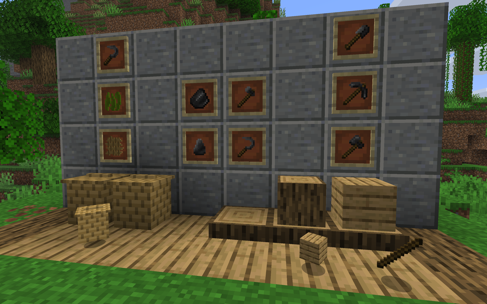

# Sheltercraft

Minecraft mod providing a smoother early-game evolution.

Features are inspired on real-life stone age survival techniques.

Gather flints, sharpen them, cut logs on a stump, weave plant fiber into wicker ...

## Compatibility

- Minecraft version: 1.21.8
- Forge version: 58.0.4

World generation uses experimental features. Do not be afraid of the "Game creation" warning.

## Features

Sheltercraft comes with an __in-game advancement page__ that fully describes all available features ! 

- __Flint chipping__ (right click on top of a stone block) and early-game flint tools using FlintFlakes.
- Gathering logs now requires an axe (Flint Hatchet before log harvesting)/
- Sticks may be gathered from leaves.
- __CuttingStump__ to transform logs into planks and planks into sticks (planks and sticks recipes are disabled).
- __FlintSickle__ to gather __PlantFibers__ from grass.
- Weave PlantFiber into Wicker (allows to craft __WickerBasket__ for early-game storage).
- __Strainer__ to gather more flints from gravel + occasionally gather __Whetstone__.
- Sharpening FlintFlakes with a Whetstone to craft __SharpenedFlints__ (and relative tools).
- Granite deposits contains blocks with Whetstones to gather more of them. Requires SharpenedFlint pickaxe or better.
- __Wooden and Stone tools are disabled.__
- Animals drop __AnimalSkin__ that must be processed into __Rawhide__ using a __TrapperKnife__.
- Salt Rawhide, Soak it, Tan it (using ClayTub + Water + WoodBark), Dry it (using DryingRack) to obtain Leather.
- WoodenTub and DryingRack has long processing times (6 and 3 minutes respectively).
- __PotteryKiln__ to fire clay pots.
- __ClayTub__ for early Salt production (by evaporation) + early leather tanning.

TODO: Sharpened Flint features screenshots (strainer, sharpened tools, granite with whetstone)

TODO: Leather working screenshots (rawhide, leather, wooden tub, drying rack, trapper knife)

TODO: Pottery features screenshots

## License

If you are interested in using this mod in your own modpack, you are free to do so. I'll be glad to hear about your work !

All code/textures/models are original and free of right (license coming soon).

## Development

For any question, suggestion or issue, feel free to open an issue.

This mod is developed in order to be integrated into a modpack I'll be working on as soon as this mod is stable enough.

Here is a quick list of the next features I plan to add:

#### Miscellaneous

- Add mod configuration
- Fix all sounds and animations
- Remove experimental feature warning or use a different world generation

#### Pottery - Improvements

- Add pottery recipes (for more storage options ? Maybe food storage ?)

#### Cooking and Food balancing

- Still in early design phase
- Make early food sources scarcer
- Make cooking more important (bonuses ? Meals to stack bonuses ?)
- Do not make it too complex (e.g. no food decay)

#### Leather Working - Improvements

- LeatherWorkerHammer (one more step to leather)
- For IronAge: wooden tanningTub to have 4 rawhide at same time (4x less water and faster)
- For mod integration: possibility to automate using create Press + WindTurbine

#### Copper and Bronze Age

- Still in early design phase
- Unlock copper tools and maybe bronze tools
- Make iron a mid-game resource
